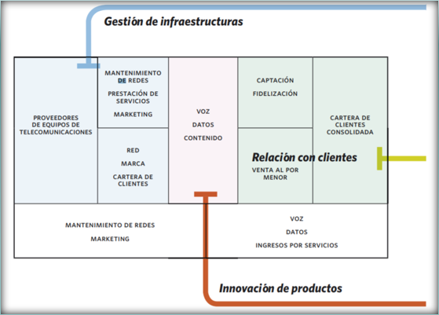
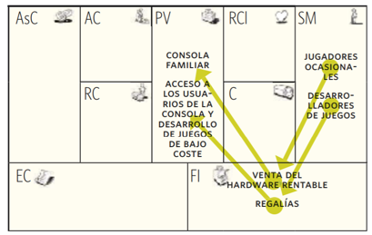
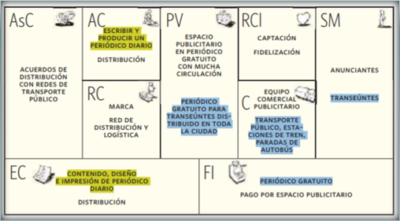
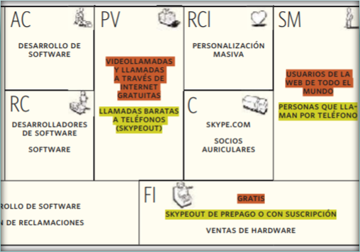

# Patrones de modelo de negocio

## ¿Que es?

Diferentes organizaciones pueden tener modelos de negocio con características, comportamientos u organizaciones similares de los diferentes módulos del modelo de negocio. Estas similitudes se conocen como patrones de modelo de negocio.

Se describen cinco patrones a partir de conceptos importantes y se ha «traducido» al idioma del lienzo de modelo de negocio para permitir la comparación de conceptos, facilitar su comprensión y simplificar su aplicación. 

El objetivo de la definición y descripción de los patrones de modelo de negocio es reformular conceptos empresariales conocidos con un formato estandarizado (el lienzo de modelo de negocio) para que pueda ser utilizada de forma inmediata en el modelo de negocio.

## Desagregación de modelos de negocio

### ¿En que consiste?

El concepto de empresa «desagregada» sostiene que existen fundamentalmente tres tipos de actividades empresariales diferentes: relaciones con clientes, innovación de productos e infraestructuras.

Los tres pueden coexistir en una misma empresa, aunque lo ideal es que se desagreguen en entidades independientes con el fin de evitar conflictos o renuncias no deseadas.

- **Relaciones con clientes**: La función de estas empresas es buscar y conseguir clientes y en establecer relaciones con ellos.

- **Innovación de productos**: La función de estas empresas es desarrollar nuevos productos y servicios que resultan atractivos.

- **Infraestructura**: Consiste en la construcción y gestión de plataformas para tareas repetitivas.

Algunos sugieren que las empresas deberían centrarse en una de las tres disciplinas de valor que proponen: excelencia operativa, liderazgo del producto o intimidad con el cliente. Esto debido a que cada una de estas 3 están sujetas a factores diferentes, que pueden entrar en conflicto e incluso provocar renuncias no deseadas.

### Ejemplo con compañía de telefonía móvil

Las empresas de telecomunicaciones móviles han empezado a desagregar sus actividades. Antes la competencia se basaba en la calidad de la red, pero ahora las empresas prefieren compartir la red con sus competidores o externalizar las operaciones de red a los fabricantes de equipos.

## Modelos de negocio de larga cola

El concepto de long tail se utiliza para describir un cambio en las empresas multimedia, que pasaron de vender grandes cantidades de un número reducido de éxitos a vender una amplia gama de productos especializados que, por separado, tienen un volumen de ventas relativamente bajo. 

Anderson explicó cómo muchas ventas esporádicas pueden generar un total de ingresos equivalente, o incluso superior, al total de ingresos obtenido con éxitos de ventas. Anderson cree que este fenómeno de la industria multimedia se desencadenó a causa de tres factores económicos:

### Democratización de las herramientas de producción

La bajada de los precios de la tecnología permitió que los usuarios individuales accediesen a herramientas que hace tan sólo algunos años tenían precios elevados. Ahora millones de aficionados pueden grabar música, realizar cortos y diseñar software sencillo con resultados profesionales.

### Democratización de la distribución

Internet ha convertido la distribución de contenido digital en un producto básico y ha reducido drásticamente los costes de inventario, las comunicaciones y las transmisiones, abriendo así nuevos mercados para los productos especializados.

### Bajada de los costes de búsqueda para coordinar la oferta y la demanda

El verdadero desafío que plantea la venta de contenido especializado es encontrar compradores que pueden estar interesados. Los potentes motores de búsqueda y recomendación, las calificaciones de los usuarios y las comunidades de interés han facilitado esta tarea enormemente.

### Ejemplo plataforma de streaming

Las plataformas de streaming empezaron a alquilar muchas películas y series. Cada una de estas películas tienen un índice de alquiler relativamente bajo, pero el total de ingresos generado por el amplio catálogo de películas de estas plataformas, está al mismo nivel que el de los grandes éxitos de taquilla.

## Plataformas multilaterales

### ¿Qué es una plataforma multilateral?

Se trata de plataformas que reúnen a dos o más grupos de clientes distintos pero dependientes entre sí y actúan como intermediarios entre estos grupos para crear valor.

Las tarjetas de crédito, por ejemplo, vinculan a los comercios con titulares de las tarjetas; las consolas vinculan a los desarrolladores de juegos con los jugadores.

Para crear valor, la plataforma debe traer y atender a todos los grupos al mismo tiempo. El valor de la plataforma para un grupo de usuarios determinados depende en gran medida del número de usuarios que haya en los otros lados de la plataforma.

A veces, las plataformas multilaterales solucionan este problema subvencionado a un segmento del mercado. La prestación de servicio a todos los grupos de clientes suponen un gasto para el operador de una plataforma, que a menudo decide traer a un segmento con una propuesta de valor de bajo coste o gratuita para así captar a los usuarios del otro lado de la plataforma.

Los operadores de plataformas multilaterales se enfrentan a dificultades como determinar la parte que deben subvencionar o la fijación del precio adecuado para captar clientes.

Los operadores de plataformas multilaterales deben hacerse las siguientes preguntas:

- ¿Podemos atraer a un número suficiente de clientes en cada lado de la plataforma?.
- ¿Qué lado está más ajustado a los precios?.
- ¿Es posible atraer a ese lado con una oferta subvencionada?.
- ¿El otro lado de la plataforma generará ingresos suficientes para cubrir las subvenciones?.

Las tres empresas utilizan plataformas multilaterales, aunque las diferencias entre modelo de negocio de Sony y Microsoft y el enfoque de Nintendo son considerables, lo que demuestra que en los mercados no siempre hay una solución única.

Por su parte Sony y Microsoft se enfocaban en la calidad de los videojuegos, enfocándose en el jugador habitual, lo que hacía que produjeran consolas caras y sofisticada, que para poder ser vendidas, las empresas tenían que entrar a subvencionar el hardware y vender más barato por mucho tiempo.

Por otra parte, Nintendo al ver que no podía competir ante esto, cambió su enfoque, cambiando el publico a jugadores ocasionales, con un hardware relativamente más barato y una innovación en el tipo de consola y juegos.

## Gratis

### ¿Por qué un modelo de negocio gratuito?

Los productos gratuitos siempre han sido una propuesta de valor atractiva, cualquier vendedor o economista podría confirmar que la demanda que se genera con un precio de cero es muy superior a la generada con quinientos pesos o cualquier otro precio.

Las ofertas gratuitas han eclosionado en los últimos años, especialmente en internet. Sin duda, la cuestión es cómo se puede ofrecer algo gratis de forma sistemática y, aun así, percibir uno ingresos sustanciosos.

Existen varios patrones que posibilitan la integración de productos y servicios gratuitos en un modelo de negocio. Algunos de los patrones Gratuitos tradicionales son conocidos:

- **Publicidad**: Que se basa en el patrón de plataformas multilaterales.

- **Modelo Freemium**: Que consiste en promocionar servicios básicos de forma gratuita y cobrar una cuota por los servicios premium.

Por ejemplo, la creación y grabación de una canción supone una inversión de tiempo y dinero para el artista, pero el coste de su copia y distribución en formato digital a través de internet, siempre y cuando tenga otras fuentes de ingresos , como los conciertos y la mercadería, para cubrir gastos.

La publicidad es una fuente de ingresos arraigada que hace posible la existencia de ofertas gratuitas. Está presente en la televisión, la radio, internet, y en una de sus forma más sofisticadas, en los anuncios en Redes Sociales. Es un modelo de negocio, las ofertas GRATIS subvencionadas con publicidad constituyen una forma específica de patrón de plataforma multilateral. En un lado de la plataforma el objetivo es atraer a los usuarios con contenido, productos o servicios gratuitos, mientras que en el otro se generan ingresos mediante la venta de espacio a los anunciantes.

### Ejemplo Metro

Este periódico gratuito, nació en Estocolmo y ahora está disponible en cientos de ciudades de todo el mundo, es un sorprendente ejemplo de este patrón. La genialidad de este periódico reside en la modificación que hizo del modelo de diario tradicional: en primer lugar, ofreció el periódico gratis, y en segundo lugar, concentró su distribución en las zonas de paso con mucho tránsito y en las redes de transporte público.

### Freemium

Se refiere a un modelo de negocio, basado principalmente en internet, que combina servicios básicos gratuitos con servicios premium de pago.

El modelo freemium se caracteriza por contar con una amplia base de usuarios que disfrutan de una oferta gratuita sin condiciones. La mayoría de estos usuarios nunca se convierten en clientes de pago y lo habitual es que tan sólo un porcentaje inferior al 10% de todos los usuarios se suscriba a los servicios premium de pago.

Este pequeño porcentaje es el que subvenciona la oferta gratuita de la que disfrutan los demás usuarios. El modelo es viable porque el servicio gratuito que se presta a los usuarios tiene un coste muy bajo.

### Ejemplo Skype

Skype desarrolló un software con este nombre que, una vez instalado en un ordenador o smartphone, permite a los usuarios hacer llamadas de un dispositivo a otro, sin coste alguno. Este servicio es posible gracias a una estructura de costes totalmente diferente a la de un operador de telecomunicaciones. Las llamadas gratuitas se realizan a través de internet, con una tecnología, P2P que utiliza el hardware del usuario e internet como infraestructura de comunicaciones. De este modo, Skype no tiene que gestionar su red como una empresa de telecomunicaciones y los gastos en los que incurre para dar soporte a usuarios adicionales son mínimos.

### Cebo y anzuelo

Hace referencia a un patrón de modelo de negocio en el que una oferta inicial atractiva, económica o gratuita fomenta la compra repetida de productos o servicios relacionados en el futuro. Este patrón también se conoce como modelo de reclamo publicitario (loss leader) o de "cuchilla y hoja de afeitar" (razor and blades).

El modelo del reclamo publicitario se refiere a una oferta inicial subvencionada, en la que incluso pierde dinero, cuyo objetivo es generar beneficios con las compras relacionadas posteriores. La cuchilla y la hoja de afeitar es un modelo de negocio que hizo famoso el empresario americano King C. Gillete, inventor de la cuchilla de afeitar desechable. Gillete utilizó el patrón del cebo y el anzuelo para describir la idea general de atraer a los clientes con una oferta inicial para ganar dinero con las ventas posteriores.

### Ejemplo compañías de teléfonos

El sector de la telefonía móvil es un buen ejemplo de patrón del cebo y el anzuelo basado en una oferta gratuita. Ahora es habitual que los operadores de redes móviles ofrezcan teléfonos gratuitos. Al principio, los operadores pierden dinero, pero lo recuperan rápidamente con las cuotas de servicio mensuales. Los operadores proporcionan una satisfacción instantánea con una oferta gratuita que después genera ingresos recurrentes.