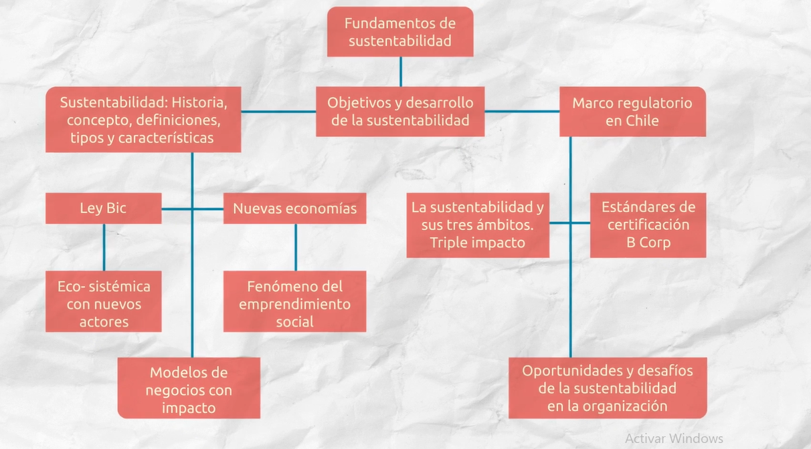

# Notas

## Semana 1 

### Introducción a los conceptos

La historia de la sustentabilidad comienza en Alemania en el siglo XVII, termino que usaban los leñadores refiriéndose al uso sustentable de los recursos forestales manteniendo un equilibrio entre la tala de arboles y el cuidado de los nuevos arboles.

En el año 2000 en la Cumbre del Milenio 191 países acordaron trabajar en favor de 8 objetivos y 17 metas a ser cumplidas en el 2015.

Entre los objetivos estaban:

- Erradicar la pobreza extrema y el hambre.
- Lograr la igualdad de género.
- Garantizar la sostenibilidad del medio ambiente.
- Reducir la mortalidad infantil.
- etc.

### Emprendimiento social

De esta forma se han generado nuevas economías que nos han llevado al fenómeno del **emprendimiento social**, el cual es mesclar la pasión de realizar una misión social con las características que definen el lanzamiento de un negocio, como la disciplina, la ilusión y la innovación, esto se relaciona con la **sostenibilidad** en el sentido de que busca una equidad humana permitiendo el bienestar de las personas y la salud del planeta.

### Modelos de negocio con impacto

Permiten dar sustentabilidad ya que se enfocan en lo **ecológico**, **económico** y lo **social**. Ademas existe una ley que permite el desarrollo de sociedades `Beneficio de interés colectivo` que permite a los países promover empresas que aporten a la colectividad y al medio ambiente, sin embargo, en Chile aún no existe esta ley.

### Ley Bic

Esta manera se puede entender como se relacionan diversas sociedades comerciales de cualquier rubro o sociedades sin fines de lucro y que busquen generar valor económico, social y ambiental a sus negocios. Permite que se desarrolle mejor cuidado del medio ambiente, desarrollando un `ecosistema con nuevos actores`.

## Fundamentos de sustentabilidad

Son aquellos que nos permiten dar mayor viabilidad a las empresas de forma de bienestar a la sociedad, al medio ambiente y con una economía que garantice la equidad.

### Marco regulatorio en Chile

En Chile se encuentra regulado por la ley de residuos, ley medioambiental, entre otras. Permitiendo que se reduzcan los impactos ecológicos provocados por la actividad industrial. Ademas la sustentabilidad tiene injerencia en tres ámbitos que son:

- Ambiental.
- Económico.
- Social.

## La sustentabilidad y sus 3 ámbitos

Existe la certificación `B corp` que es un sello de calidad que busca crear impacto positivo en la sociedad. Este tipo de certificaciones nos permite diferenciarnos como una empresa que busca ser sustentable, y así iniciar un proceso de mejora continua para lograr un mayor impacto, obtener mayor visibilidad y reconocimiento o atraer y retener talento de personas que quieren trabajar en empresas con valores y compromiso social. Es necesario determinar que valor social estamos generando y por tanto tenemos que integrar la medición de impacto como un elemento necesario y corriente de la gestión empresarial como lo es la contabilidad económica y financiera.

## Semana 2

### Modelos de negocio con impacto

Hoy en dia esta cambiando la forma de hacer negocios, las organizaciones ya no busca simplemente generar valor económico, sino que buscan generar valor social, ambiental y ecológico.

El ENI DI TELA, espacio de negocios inclusivo, fundado en Argentina en 2010, define como negocios inclusivos a aquellos que están intencionados en generar un impacto social positivo con sostenibilidad económica.

1. **Estrategia de adaptación**: Esta estrategia busca proveer bienes o servicios de calidad a precios accesibles por medio de la adaptación de alguna de las variables del "mix comercial" (productos, precios, plaza, comunicación).

2. **Estrategia de Innovación**: El eje central de esta estrategia es poder proveer de productos o servicios de calidad pero con precios alcanzables, apalancando mediante la innovación.

3. **Estrategia de foco**: Esta estrategia busca generar sistemas que puedan generar soluciones resolviendo un único problema el cual se trabaja por medio de alianzas con organizaciones de la sociedad civil y/o gubernamentales.

4. **Superpuestas**: Definen que las actividades empresariales junto a los programas sociales son la misma actividad, es decir, que su propósito desde un principio es ser sostenible.

5. **Integradas**: Esta estrategia busca trabajar la alianza con las organizaciones de la sociedad civil y/o gobiernos con el fin de resolver varios problemas en paralelo.

### Ley BIC

También conocida como Ley de Sociedades de Beneficio e Interés Colectivo, esta ley busca dar promoción a aquellos modelos de negocio de organizaciones que sean de "triple impacto" (social, ambiental y económico).

La principal función de esta ley es que cualquier empresario pueda adaptar su empresa (o generar una subsidiaria, o crear con una empresa visión social).

*Hay que  diferenciar una empresa BIC de una empresa B,  pues en la primera denominación se trate de empresas que cuentan con un reconocimiento normativo del país (o Estado en el caso de los EE.UU.) el cuál reconoce y promueva a estas empresas;  mientras que, en la segunda denominación (empresas B), se trata de aquellas compañías que deciden certificarse cumpliendo altos estándares que se ven reflejados en un sello que las identifica*.

En Chile aún no contamos con un marco jurídico que tenga regulación referente a derechos, deberes, garantías de aquellas nuevas empresas que sean también actores sociales. No existe aún un marco jurídico que regule sus derechos y obligaciones, deberes y garantías.

### El triple Impacto

El triple impacto apunta a hacer cambios profundos en las distintas organizaciones. No sólo se busca rentabilizar sino se pueda generar impacto en la ciudadanía de una forma real y con mesura, además de un impacto positivo en la naturaleza.

Esto apunta a realizar un cambio profundo en las organizaciones.

Una explicación más detallada de sus tres ejes es la siguiente:

- **Impacto Ambiental**: En sus procesos productivos todas las empresas generan contaminación (residuos a partir de recursos naturales). Las empresas de triple impacto buscan disminuir este aspecto de forma colaborativa y poder innovar en este sentido, como por ejemplo, reutilizando hojas impresas por un lado, reciclando, así como también adquiriendo maquinaria con bajo consumo energético.

- **Impacto Social**: Una organización se manifiesta socialmente al generar trabajo, poder compartir con los distintos actores, generar inversiones en determinadas zonas y pagar en tiempo y forma los impuestos. Cuando un negocio decide ser de triple impacto, comienza a desarrollar sus objetivos centrales para aumentar su valor social. Por ejemplo, la organización dentro de la gestión impone un proceso interno de transparencia que define promoción interna, políticas de remuneraciones, beneficios a los trabajadores y familia, junto con mejorar el clima laboral.

- **Impacto Económico**: Las utilidades son parte de los objetivos de las empresas triple impacto, incluso para garantizar a futuro su valor en el medioambiente y la sociedad. Pero también se busca lograr un cambio de mentalidad en las empresas y personas, al no perseguir el objetivo económico a cualquier costo. Si bien la generación de ingresos puede verse afectada en un inicio, se ha comprobado que hoy en día los consumidores que pagan por productos que ofrecen empresas sociales valoran mucho este tipo de iniciativas.

### Definir que tipo de desarrollo sustentable posee una organización según el contexto histórico y asociado al marco regulatorio chileno

Se podría decir que la empresa escogida, Notco, es una empresa de triple impacto, ya que toca temas de medio ambiente, sociales y económicos.

En cuanto a lo ambiental es sabido que la industria ganadera a nivel global contamina con el 15% de las emisiones de gases de efecto invernadero y que por un corte de 300 gramos de carne se necesitan 4.500 litros de agua, en este sentido Notco pretende reducir la contaminación que puede llegar a generar la sobre-explotación de esta industria, entregando una alternativa de igual calidad, pero mas amigable con el medio ambiente.

En el ámbito social, Notco pretende generar una cultura de trabajo más amigable con el medio ambiente, a través de la promoción y concientización de los riesgos que tiene sobre explotar una industria, y de la responsabilidad que tiene el sector productivo con el medio ambiente.

Y en el sentido económico, Notco es una de las empresas "unicornio" de LATAM. En septiembre de 2020, recaudo 85 millones de dolares en una ronda de financiación de serie C. Entre sus inversores se incluyen el fondo de capital riesgo de la marca retador The Craftory, Bezos Expeditions de Jeff Bezos y otros. Como se puede ver, es una empresa aún en crecimiento y con un gran potencial, que ha logrado un equilibrio entre el crecimiento económico y el medio ambiente.

### Marco regulatorio chileno

Si bien Chile no posee una ley de BIC, tiene otros marcos regulatorios como el  Plan de Acción Nacional de Cambio Climático (PANCC 2017-2022) o el plan nacional de medio ambiente, los cuales, entre otras cosas, buscan reducir las emisiones de gases de efecto invernadero y el uso desmesurado de agua en industrias productivas, en este sentido Notco está alineada con estos objetivos, si bien, algunos de sus productos pecan en no ser 100% saludables, ya que pueden llegar a tener mas de 2 sellos, aún así la producción de estos es mucho más sustentable y amigable con el medio ambiente, lo cual les da una ventaja competitiva respecto a las demás empresas alimentarias.